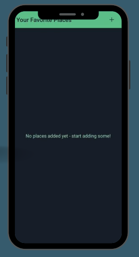
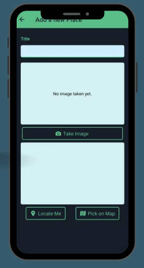
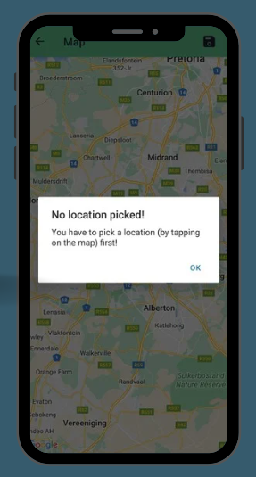
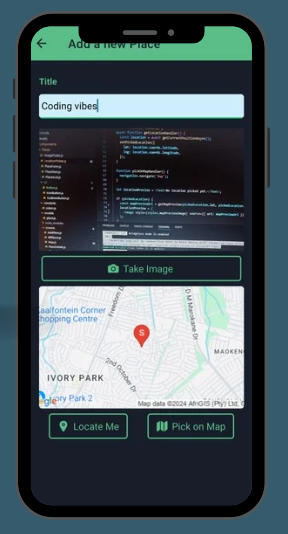

# Gallery Application with Geolocation and SQLite

This is a **Gallery Application** built using **React Native** with geolocation features that allow users to view images and track where they were taken. The app also integrates **SQLite** for local image metadata storage.

## Features

### Image Gallery:
1. **Image Display:**
   - View images in a grid or list format.
   - Open images in full-screen mode or a gallery carousel view.
   
2. **Image Metadata Storage:**
   - Store image details such as file paths, timestamps, and geolocation data.
   - CRUD operations (Create, Read, Update, Delete) for managing images.

### Geolocation Integration:
1. **Tag Images with Location:**
   - Automatically capture latitude and longitude when an image is taken or uploaded.
   - Display a map pinpointing the locations of all stored images.

2. **Map Integration:**
   - Use **Google Maps** or **Mapbox** to display image locations.
   - Utilize markers or indicators to represent image locations on the map.

### SQLite Database:
1. **Local Storage:**
   - Store image metadata using SQLite for offline accessibility.
   - Ensure efficient querying and retrieval of image data.
   
2. **Database Operations:**
   - Implement CRUD operations for managing image records.
   - Enable filtering and sorting images by location and timestamp.

### User Interface:
1. **Navigation & Usability:**
   - Intuitive UI for browsing images and interacting with the map.
   - **Pinch-to-zoom** for images and maps.
   - **Swipe gestures** for navigating between images.

2. **Search & Filter:**
   - Search for images based on location, date, or metadata.
   - Apply filters to display images by location or date range.

### Security and Permissions:
1. **Permissions Handling:**
   - Request and manage necessary permissions for accessing geolocation and storing images.
   
2. **Data Security:**
   - Implement secure storage practices to protect user data.

### Testing & Performance:
1. **Functional Testing:**
   - Ensure geolocation tagging and SQLite integration work correctly.
   - Verify smooth gallery browsing and map interactions.
   
2. **Performance Optimization:**
   - Optimize app performance for handling large image sets.
   - Conduct thorough testing to maintain stability.

## Technology Stack
- **Frontend:** React Native
- **Styling:** CSS
- **Database:** SQLite
- **Geolocation:** React Native Geolocation API
- **Maps:** Google Maps / Mapbox


## Installation

To run this project locally, follow these steps:

1. Clone the repository:
   ```bash
   git clone https://github.com/your-username/gallery-geolocation-app.git
   ```
2. Navigate to the project directory:
   ```bash
   cd gallery-geolocation-app
   ```
3. Install dependencies:
   ```bash
   npm install
   ```
4. Start the application:
   ```bash
   npx react-native run-android  # For Android
   npx react-native run-ios      # For iOS
   ```


## Screenshots






## License
This project is licensed under the MIT License.


